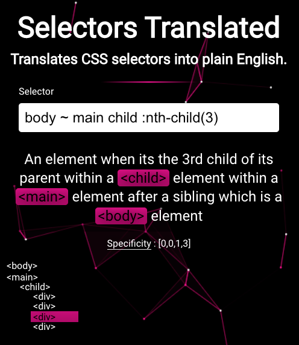

<h1 align="left"><strong> Hello There, I'm <a href="https://sidbelbase.me">Yarden Porat.</a></strong>
</h1>

<h3 align="left">
I am a passionate and enthusiastic self-taught web developer.
</h3>

<a target="_blank" href="https://linkedin.com/in/yarden-porat/">

</a>


## Projects

<details>
  <summary>
     <strong>Selectors Translated</strong>: CSS selector translator and visualizer
  </summary>

Click on the image to view the project:

<div style="width: 100%; display: grid; place-items: center;">
  
</div>

</details>
<details>
  <summary>
     <strong>LinkedIn Frame Generator</strong>: Create custom LinkedIn avatar frames
  </summary>
<br>
Not long ago LinkedIn added a feature that allows adding a frame to your profile picture, letting everyone know if your are #hiring or #opentowork.

Now, you can create your own custom frames, adding a little more character to your LinkedIn profile.

<div style="width: 100%; display: grid; place-items: center;">
  
</div>

</details>
<details>
  <summary>
     <strong>ESLint plugin: validate declared imports</strong>: validate typescripts globally declared modules
  </summary>
<br>

[](https://github.com/yardenporat/eslint-plugin-validate-declared-imports/actions/workflows/test.yml)
[](https://www.npmjs.com/package/eslint-plugin-validate-declared-imports)

When you declare modules with typescript, filepaths are not validated to be correct.

Example:

```ts
declare module "*.module.css" {
  const classes: { [key: string]: string };
  export default classes;
}
```

This will not throw an error, even though path is incorrect:

```ts
import styles from "asdasdasdasdasd.module.css";
```

### Usage

Add `validate-declared-imports` to the plugins section of your `.eslintrc` configuration file. You can omit the `eslint-plugin-` prefix:

```json
{
  "plugins": ["validate-declared-imports"]
}
```

Then configure the rules you want to use under the rules section.

```json
{
  "rules": {
    "validate-declared-imports/no-unresolved-declared-imports": [
      "error",
      {
        "fileExtensions": [
          // Asset files: png, jpeg, svg...
          ".jpg",
          // Style files
          ".module.css", // CSS Modules
          ".module.scss", // SCSS Modules
          ".module.less", // Less Modules
          ".st.css" // Stylable files
        ]
      }
    ]
  }
}
```

</details>

<br>

<details>
  <summary>
    <strong>MORE ABOUT ME</strong>
  </summary>

```ts
const yardenporat = {
  education: [
    "BA - Reichman University (IDC Herzliya)",
    "MBA - Tel Aviv University",
  ],
  languages: ["TypeScript", "Javascript", "Python", "Bash Scripts"],
  frameworks: ["Node.js", "React.js", "Next.js"],
  css: ["CSS", "Sass", "Stylable"],
  tests: ["playwright", "mocha", "chai", "sinon"],
  DBs: ["MongoDB", "SQL"],
  tools: ["Git", "Wordpress", "Electron"],
};
```

</details>

<a target="_blank" href="https://github.com/yardenporat/">

</a>
